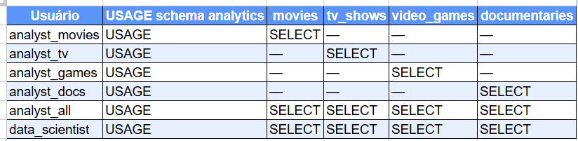

- Matriz de Permissões



- Scripts de criação de usuários
```
CREATE USER analyst_movies WITH PASSWORD 'an@lyst#movies';
CREATE USER analyst_tv WITH PASSWORD 'an@lyst#tv';
CREATE USER analyst_games WITH PASSWORD 'an@lyst#games';
CREATE USER analyst_docs WITH PASSWORD 'an@lyst#docs';
CREATE USER analyst_all WITH PASSWORD 'an@lyst#all';
CREATE USER data_scientist WITH PASSWORD 'd@t4#scientist';

-- Concede a permissão USAGE no schema analytics a todos os novos usuários
GRANT USAGE ON SCHEMA analytics TO  analyst_movies,
									analyst_tv,
									analyst_games,
									analyst_docs,
									analyst_all,
									data_scientist;

-- Concessão de permissões específicas (princípio de menor privilégio)
GRANT SELECT ON TABLE analytics.movies TO analyst_movies;
GRANT SELECT ON TABLE analytics.tv_shows TO analyst_tv;
GRANT SELECT ON TABLE analytics.video_games TO analyst_games;
GRANT SELECT ON TABLE analytics.documentaries TO analyst_docs;

-- Concede permissão de SELECT em todas as tabelas no schema 'analytics' ao usuário 'analyst_all'.
GRANT SELECT ON ALL TABLES IN SCHEMA analytics TO analyst_all;

-- Concede permissão de SELECT em todas as tabelas no schema 'analytics' ao usuário 'data_scientist'.
GRANT SELECT ON ALL TABLES IN SCHEMA analytics TO data_scientist;
```

- Procedimentos de teste de acesso


