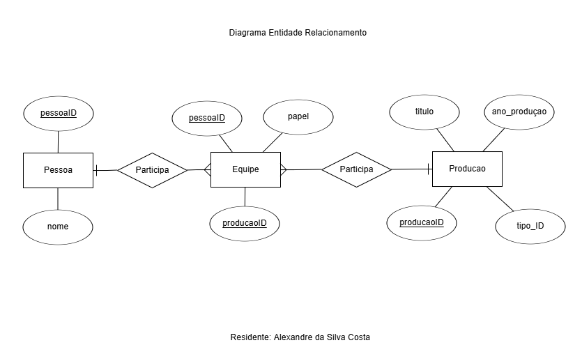

- DER (Diagrama Entidade Relacionamento)



- Definições de tabelas com restrições

Como representado no script `sql/01_criacao_banco.sql`, as tabelas com restrições são:

| Tabela     | Restrição usada                      |
|------------|--------------------------------------|
| `producao` | PRIMARY KEY                          |
| `pessoa`   | PRIMARY KEY                          |
| `equipe`   | PRIMARY KEY e FOREIGN KEY            |

```sql
CREATE TABLE raw_data.producao (
    producaoID INT PRIMARY KEY,
    titulo VARCHAR(255),
    ano_producao INT,
    tipo_ID INT
);

CREATE TABLE raw_data.pessoa (
    pessoaID INT PRIMARY KEY,
    nome VARCHAR(255)
);

CREATE TABLE raw_data.equipe (
    pessoaID INT,
    producaoID INT,
    papel TEXT,
    PRIMARY KEY (pessoaID, producaoID),
    FOREIGN KEY (pessoaID) REFERENCES raw_data.pessoa(pessoaID),
    FOREIGN KEY (producaoID) REFERENCES raw_data.producao(producaoID)
);
```
- Estratégias de indexação

```sql
CREATE INDEX idx_nome_pessoa ON raw_data.pessoa (nome); -- indice para nome
CREATE INDEX idx_equipe_producao ON raw_data.equipe(producaoID); -- indice para buscar equipe pela producaoID
CREATE INDEX idx_equipe_papel_producao ON raw_data.equipe(papel, producaoID); -- indice para buscar equipe por papel e producao
CREATE INDEX idx_producao_ano ON raw_data.producao(ano_producao); -- indice para buscar ano de producao
CREATE INDEX idx_producao_tipo_ano ON raw_data.producao(tipo_ID, ano_producao); -- indice para buscar tipo e ano de producao
```

- Estratégias de particionamento

```sql
CREATE TABLE analytics.movies_1980s PARTITION OF analytics.movies
    FOR VALUES FROM (1980) TO (1990);
CREATE TABLE analytics.movies_1990s PARTITION OF analytics.movies
    FOR VALUES FROM (1990) TO (2000);
CREATE TABLE analytics.movies_2000s PARTITION OF analytics.movies
    FOR VALUES FROM (2000) TO (2010);
CREATE TABLE analytics.movies_2010s PARTITION OF analytics.movies
    FOR VALUES FROM (2010) TO (2020);
CREATE TABLE analytics.movies_2020s PARTITION OF analytics.movies
    FOR VALUES FROM (2020) TO (2030);
```
