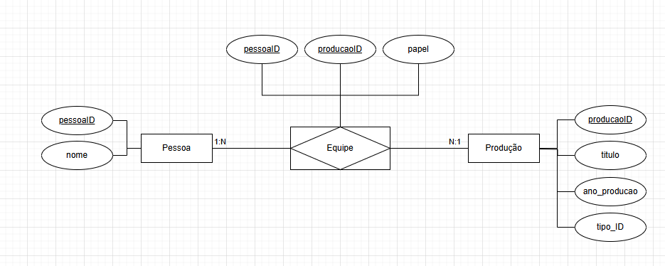

# Documentação do Esquema do Banco de Dados

### 1. DER (Diagrama Entidade-Relacionamento)




### 2. Definições de tabelas com restrições

```sql
CREATE TABLE Pessoa (
    pessoaID INT PRIMARY KEY,
    nome VARCHAR(255)
);

CREATE TABLE Producao (
    producaoID INT PRIMARY KEY,
    titulo VARCHAR(255),
    ano_producao INT,
    tipo_ID INT 
);

CREATE TABLE Equipe (
    pessoaID INT,
    producaoID INT,
    papel TEXT,

    PRIMARY KEY (pessoaID, producaoID),
    FOREIGN KEY (pessoaID) REFERENCES Pessoa(pessoaID),
    FOREIGN KEY (producaoID) REFERENCES Producao(producaoID)
);

```

### 3. Estratégias de indexação

```sql
CREATE INDEX idx_producao_ano ON Producao(ano_producao);
CREATE INDEX idx_titulo ON Producao(titulo);
CREATE INDEX idx_tipo_ID ON Producao(tipo_ID);
CREATE INDEX idx_nome ON Pessoa(nome);```