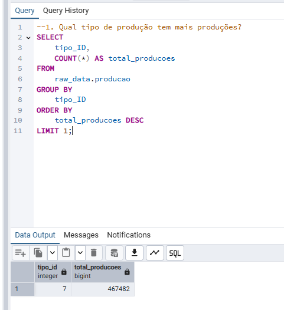
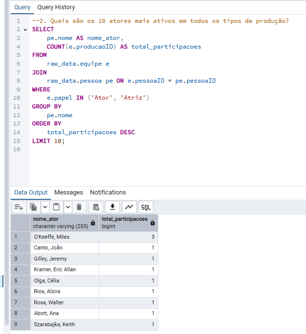
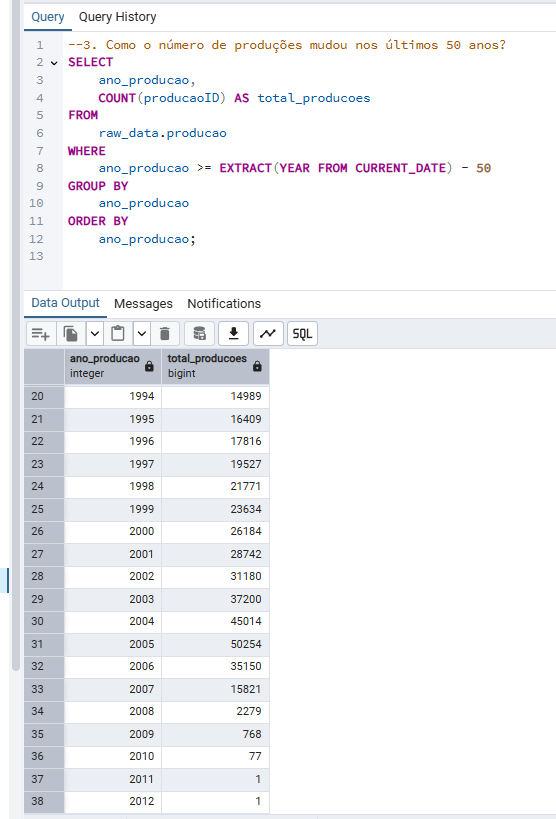
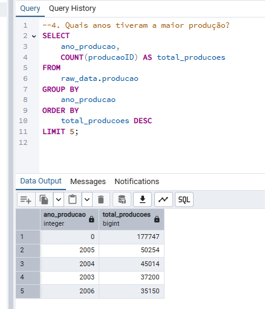
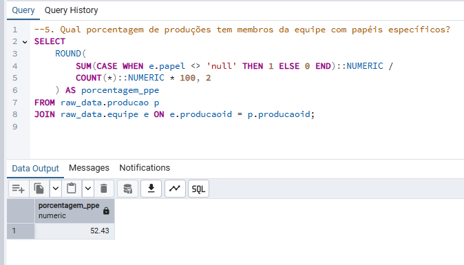

- Respostas de perguntas de negócio

### 1. Qual tipo de produção tem mais produções?
#### É o tipo Animations (tipo_id = 7) com 467.482 produções.

### 2. Quais são os 10 atores mais ativos em todos os tipos de produção?

### 3. Como o número de produções mudou nos últimos 50 anos?

### 4. Quais anos tiveram a maior produção?

#### Nota-se que o ano produção = zero é, na verdade, uma ausência de informação da fonte de dados. Esse tipo de situação deve ser tratada com a área de negócios para melhorar a visualização.

### 5. Qual porcentagem de produções tem membros da equipe com papéis específicos?

