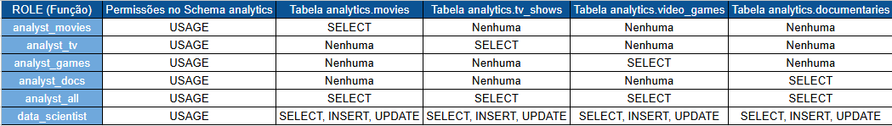
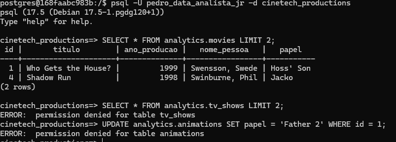
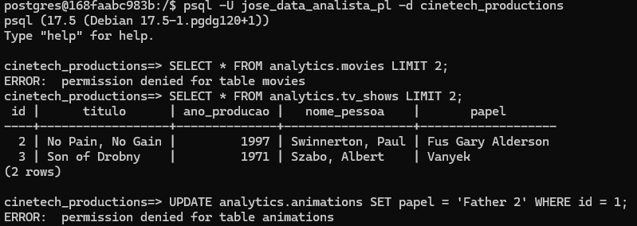
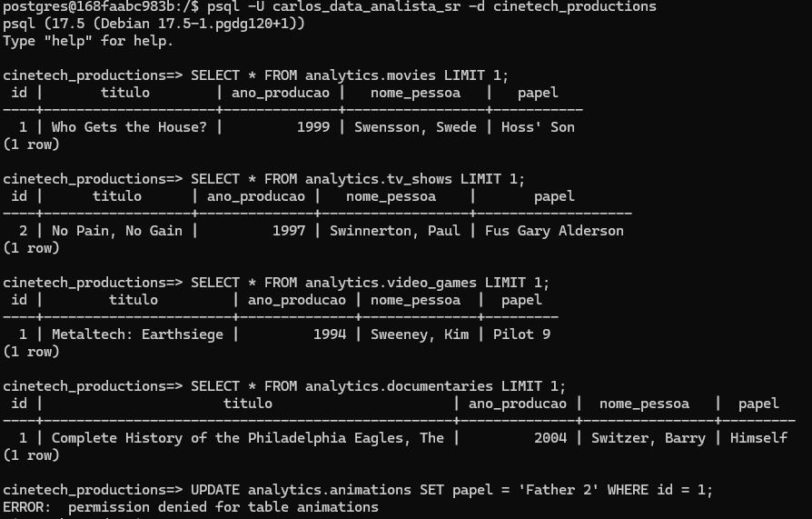
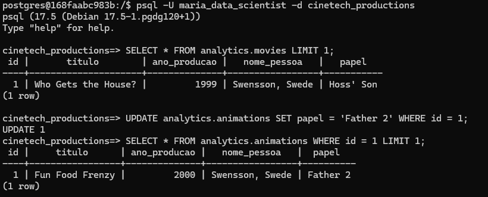

# Documentação de Acesso de Usuários

### 1. Matriz de permissões




### 2. Scripts de criação de usuários

```sql
CREATE ROLE analyst_movies NOLOGIN; -- Pode acessar apenas dados relacionados a filmes
CREATE ROLE analyst_tv NOLOGIN; --Pode acessar apenas dados relacionados a séries de TV
CREATE ROLE analyst_games NOLOGIN; -- Pode acessar apenas dados relacionados a videogames
CREATE ROLE analyst_docs NOLOGIN; -- Pode acessar apenas dados relacionados a documentários
CREATE ROLE analyst_all NOLOGIN; -- Pode acessar todos os dados analíticos (somente leitura)
CREATE ROLE data_scientist NOLOGIN; -- Pode acessar todos os dados com permissões de escrita no esquema analytics

CREATE ROLE job_data_analyst_jr NOLOGIN; -- Analista de dados Junior
CREATE ROLE job_data_analyst_pl NOLOGIN; -- Analista de dados Pleno
CREATE ROLE job_data_analyst_sr NOLOGIN; -- Analista de dados Senior
CREATE ROLE job_data_scientist	NOLOGIN; -- Ciência de dados

CREATE ROLE pedro_data_analista_jr WITH LOGIN PASSWORD 'teste#123';
CREATE ROLE jose_data_analista_pl WITH LOGIN PASSWORD 'teste#123';
CREATE ROLE carlos_data_analista_sr WITH LOGIN PASSWORD 'teste#123';
CREATE ROLE maria_data_scientist WITH LOGIN PASSWORD 'teste#123';

GRANT analyst_movies TO job_data_analyst_jr;
GRANT analyst_tv TO job_data_analyst_pl;
GRANT analyst_games TO job_data_analyst_pl;
GRANT analyst_docs TO job_data_analyst_pl;
GRANT analyst_all TO job_data_analyst_sr;
GRANT data_scientist TO job_data_scientist;

GRANT job_data_analyst_jr TO pedro_data_analista_jr;
GRANT job_data_analyst_pl TO jose_data_analista_pl;
GRANT job_data_analyst_sr TO carlos_data_analista_sr;
GRANT job_data_scientist TO maria_data_scientist;

GRANT USAGE ON SCHEMA analytics TO analyst_movies, analyst_tv, analyst_games, analyst_docs, analyst_all, data_scientist;
GRANT SELECT ON analytics.movies TO analyst_movies, analyst_all;
GRANT SELECT ON analytics.tv_shows TO analyst_tv, analyst_all;
GRANT SELECT ON analytics.video_games TO analyst_games, analyst_all;
GRANT SELECT ON analytics.documentaries TO analyst_docs, analyst_all;
GRANT SELECT, INSERT, UPDATE ON ALL TABLES IN SCHEMA analytics TO data_scientist;

```

### 3. Procedimentos de teste de acesso

1. Usuário Pedro:



2. Usuário Jose:



3. Usuário Carlos:



4. Usuário Maria: 

